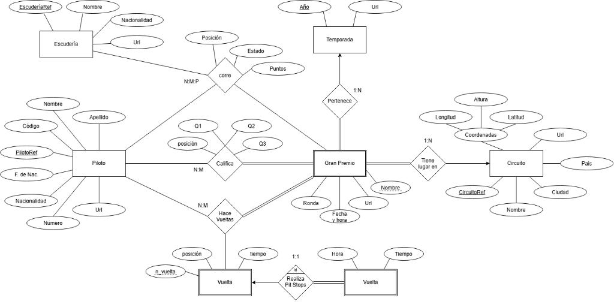
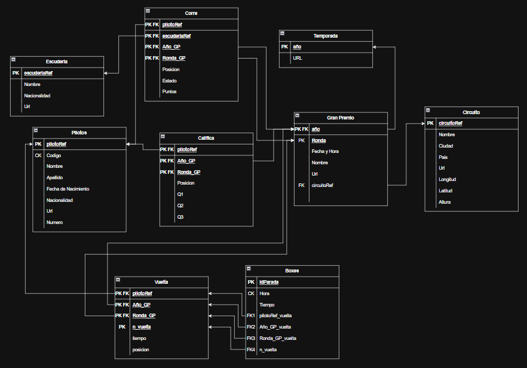

# Sistema de Gestión y Analítica de Datos de Fórmula 1

[](https://www.postgresql.org/)
[](#7-lógica-procedimental-triggers-de-auditoría-y-recálculo-de-puntos-pecl2)
[](#9-explotación-analítica-de-datos-consultas-sql-y-aplicación-python)
[](#3-modelo-conceptual-entidad-relación)
[](#2-contexto-académico-trazabilidad-y-despliegue)

> Sistema integral de base de datos relacional para la ingesta masiva, modelado, auditoría y análisis histórico de campeonatos mundiales de Fórmula 1. El proyecto combina diseño conceptual riguroso (notación Peter Chen), un pipeline ETL en dos fases en **PostgreSQL**, lógica de negocio reactiva mediante **triggers en PL/pgSQL**, control de accesos basado en roles (**RBAC**) y una aplicación interactiva por línea de comandos desarrollada en **Python** con **Pandas** y **Psycopg2**.

---

## 1. Objetivo, Funcionalidad y Resumen del Proyecto

### 1.1. Objetivos Principales
* **Diseño Conceptual y Lógico Riguroso:** Modelar la totalidad de eventos de la Fórmula 1 moderna y clásica a partir de datasets históricos brutos, capturando entidades independientes, entidades débiles dependientes en identificación, atributos compuestos y relaciones de grado superior (ternarias).
* **Pipeline de Ingesta y Limpieza ETL Tolerante a Fallos:** Diseñar un mecanismo de carga en dos fases (esquema temporal desnormalizado $\rightarrow$ esquema relacional tipado) capaz de absorber más de 17 MB de datos crudos resolviendo discrepancias de formatos de fecha, unidades de tiempo y duplicidades históricas.
* **Integridad y Lógica de Negocio en Motor:** Implementar restricciones declarativas estrictas (claves primarias compuestas, foráneas, restricciones de nulidad) complementadas con disparadores (*triggers*) procedurales en **PL/pgSQL** para auditoría en tiempo real y recálculo dinámico de clasificaciones.
* **Seguridad y Control de Acceso (RBAC):** Diseñar y verificar una política de privilegios mínimos para cuatro roles de usuario (*administrador*, *gestor*, *analista*, *invitado*).
* **Capa de Aplicación y Explotación:** Proporcionar una interfaz interactiva de consola (CLI) en Python con Pandas para consultas analíticas complejas y operaciones de inserción asistida con verificación de integridad referencial.

### 1.2. Funcionalidad General y Flujo del Sistema
El sistema cubre el ciclo de vida completo del dato deportivo:
1. **Extracción y Carga Cruda:** Los 10 archivos CSV de la Fórmula 1 se cargan masivamente mediante comandos `\COPY` en tablas intermedias de texto dentro de un esquema temporal (`temp`), aislando el motor relacional de posibles fallos de parseo.
2. **Transformación y Migración:** A través de sentencias estructuradas `INSERT INTO ... SELECT ...`, los datos se limpian, se unifican formatos heterogéneos de fechas y tiempos, se resuelven colisiones de claves mediante técnicas de descarte determinista (`DISTINCT ON`) y se puebla el esquema definitivo (`ddbb`).
3. **Mantenimiento y Auditoría Automática:** La base de datos queda protegida con triggers que registran cualquier mutación (`INSERT`, `UPDATE`, `DELETE`) en una tabla de auditoría y recalculan las tablas resumen de puntos sin intervención manual.
4. **Consulta y Gestión por Consola:** A través del cliente `src/f1.py`, los usuarios se autentican según su rol asignado, visualizan tablas analíticas formateadas y gestionan nuevas carreras y resultados de forma interactiva.

---

## 2. Contexto Académico, Trazabilidad y Despliegue

### 2.1. Contexto Académico y Autoría
* **Proyecto desarrollado por:** Iván Collado y David Martínez.
* **Titulación:** Grado en Ingeniería en Sistemas de Información (GISI).
* **Institución:** Escuela Politécnica Superior — Universidad de Alcalá (UAH).
* **Asignatura:** Bases de Datos (Prácticas PECL1 y PECL2).

### 2.2. Trazabilidad, Privacidad y Organización para GitHub
> [!NOTE]
> **Trazabilidad, Privacidad y Organización para GitHub:**  
> Este módulo conserva al 100% el diseño conceptual, las decisiones de modelado, el código SQL y la aplicación desarrollados y evaluados durante la carrera universitaria.  
> Con el fin de adaptarlo a los estándares de publicación en código abierto y portafolios técnicos:
> * **Propiedad Intelectual y Privacidad Académica:** No se incluye el documento PDF oficial del enunciado de la práctica por estricto respeto a los derechos de autor del profesorado de la Universidad de Alcalá y las normativas de privacidad académica. En su lugar, todos los requisitos funcionales, objetivos y restricciones se han sintetizado y documentado con redacción propia a lo largo de este archivo.
> * **Protección de Datos Personales:** Se retiraron borradores y memorias de laboratorio que contenían números de DNI y calificaciones académicas.
> * **Estructuración del Código:** Se reubicaron los 10 archivos CSV dentro del directorio `data/` (actualizando consecuentemente las rutas `\COPY` en `main.sql`) y se incorporó `requirements.txt` en `src/` para garantizar la ejecución inmediata y reproducible de la aplicación Python en cualquier máquina.

### 2.3. Estructura de Directorios
```text
02-bases-de-datos/
│
├── README.md                      <-- Documentación técnica completa del proyecto
├── data/                          <-- Datasets históricos en formato CSV (delimitador ;)
├── docs/                          <-- Diagramas y recursos gráficos del proyecto (modelo_er.png)
├── sql/                           <-- Script maestro SQL (DDL, ETL, triggers, tests, RBAC)
└── src/                           <-- CLI interactivo en Python y requirements.txt
```

### 2.4. Requisitos Previos
* **PostgreSQL 14 o superior** instalado y en ejecución en el puerto `5432`.
* **Python 3.10 o superior** con el gestor de paquetes `pip`.

### 2.5. Guía Rápida de Despliegue Paso a Paso

#### Paso 1: Configurar y Cargar la Base de Datos en PostgreSQL
1. Abre una terminal y crea una base de datos local llamada `pruebas` (nombre configurado por defecto en la CLI de Python):
   ```bash
   createdb -U postgres pruebas
   ```
2. Ejecuta el script desde la raíz `02-bases-de-datos`:
   ```bash
   psql -U postgres -d pruebas -f sql/main.sql
   ```
   *El script creará automáticamente el esquema temporal `temp`, cargará los 10 archivos CSV desde la carpeta `data/`, transformará y migrará los datos al esquema definitivo `ddbb`, aplicará las restricciones de integridad, activará los triggers PL/pgSQL, ejecutará la batería de validación con rollback y aprovisionará los cuatro usuarios del sistema.*

#### Paso 2: Instalar Dependencias de Python
En la terminal, dentro de `02-bases-de-datos`:
```bash
pip install -r src/requirements.txt
```

#### Paso 3: Iniciar la Consola Interactiva
Lanza la aplicación cliente:
```bash
python src/f1.py
```
* Selecciona tu rol en el menú inicial (1: Administrador, 2: Gestor, 3: Analista, 4: Invitado).
* Introduce la contraseña correspondiente:

| Rol de Usuario | Contraseña Demo | Nivel de Privilegios |
| :--- | :--- | :--- |
| **`administrador`** | `admin123` | Control total (`ALL PRIVILEGES`) sobre esquemas, tablas y secuencias. |
| **`gestor`** | `gestor123` | Manipulación de datos (`SELECT`, `INSERT`, `UPDATE`, `DELETE`) sin alteración estructural (`DDL`). |
| **`analista`** | `analista123` | Solo lectura (`SELECT`) sobre todas las tablas y vistas del esquema `ddbb`. |
| **`invitado`** | `invitado123` | Solo lectura limitada a tablas públicas (`pilotos`, `carreras`, `resultados`). |

---

## 3. Modelo Conceptual Entidad-Relación

### 3.1. Imagen Original del Diagrama E/R
El diagrama conceptual con notación clásica se fue la base de la implementación SQL posterior para capturar con precisión las dependencias semánticas del campeonato:



### 3.2. Supuestos Semánticos y Justificación de Objetos Clave
1. **Entidad Débil `Gran Premio` (`carreras`):**  
   Un Gran Premio no puede existir sin estar asociado a una temporada y celebrarse en un circuito específico. Se asume como restricción semántica que **no puede disputarse más de una carrera con el mismo nombre en el mismo circuito dentro de la misma temporada (año)**. Por tanto, su clave primaria en el modelo lógico se compone de `(anio, circuito_ref, nombre)`.
2. **Relación Ternaria `Corre` (N:M:P):**  
   Conecta simultáneamente a las entidades `Piloto`, `Gran Premio` y `Escudería`. Esta relación ternaria es semánticamente imprescindible: el resultado de una carrera (`posición`, `puntos`, `estado`) no puede asociarse únicamente al binomio piloto-carrera (un piloto puede cambiar de escudería a mitad de campeonato o a lo largo de su trayectoria deportiva) ni a la pareja piloto-escudería (disputan múltiples carreras en el año). La clave de esta relación surge de la combinación de las claves de las tres entidades intervinientes.
3. **Entidad Débil / Asociativa `Vuelta`:**  
   La relación entre `Piloto` y `Gran Premio` es de tipo muchos a muchos (N:M). Dado que se registran mediciones cuantitativas detalladas de cada vuelta (`n_vuelta`, `posición`, `tiempo`), esta relación se convierte formalmente en una entidad débil (`Vuelta`), donde cada tupla representa un giro cronometrado concreto de un piloto en una carrera determinada.
4. **Relación 1:1 `Realiza Pit Stops` y Descarte de Alternativas:**  
   Establece una restricción estricta: cada parada en boxes está unívocamente vinculada a una única vuelta de un piloto en una carrera, y una vuelta puede contener como máximo una parada registrada. Se evaluó la alternativa de aplanar `Boxes` dentro de `Vuelta` (añadiendo columnas `hora` y `tiempo_parada`), pero se descartó para respetar el diseño E/R y evitar una dispersión masiva de valores nulos (más del 95% de las vueltas de una carrera no conllevan paso por boxes).

---

## 4. Restricciones de Integridad y Resolución de Conflictos en los Datos

Durante el análisis exploratorio de los datasets en bruto (perfilado de datos) y la fase de migración al esquema definitivo, se detectaron discrepancias e inconsistencias con las restricciones del modelo relacional que requirieron decisiones de ingeniería específicas:

### 4.1. Tratamiento Justificado de Valores Nulos (Perfilado Histórico)
* **Atributos `numero` y `codigo` en `Piloto`:**  
  Se permitió explícitamente que adopten valores `NULL`. En las primeras décadas del campeonato mundial (años 50 y 60), no existía el sistema moderno de códigos fijos de tres letras (ej. `ALO`, `HAM`, `VER`) ni los dorsales asignados de forma permanente a cada piloto durante toda la temporada.
* **Atributo `posicion` en la relación `Corre`:**  
  Debe admitir valores `NULL`. Si un monoplaza sufre una avería mecánica, un accidente o una descalificación antes de terminar la prueba, el piloto carece de una posición, conservando únicamente el atributo descriptivo `estado` (ej. *"Engine"*, *"Accident"*, *"Retired"*).

### 4.2. Conflicto Crítico de Unicidad en `results.csv` y Solución con `DISTINCT ON`
Al intentar migrar los datos hacia la tabla `ddbb.corre`, la ejecución del `INSERT` falló con un error de clave duplicada:
```text
ERROR: llave duplicada viola restricción de unicidad «corre_pkey» para (ascari, French Grand Prix, 1951, reims, ferrari)
```
* **Diagnóstico del Conflicto:**  
  La clave primaria compuesta de `corre` impone que un piloto solo puede tener un resultado por carrera y escudería. Sin embargo, en la historia de la Fórmula 1 temprana (como el GP de Francia de 1951), era reglamentario compartir vehículo o inscribirse con dos monoplazas en caso de avería, lo que generó múltiples tuplas en `results.csv` para la misma combinación `(raceId, driverId, constructorId)` con diferentes estados finales.
* **Técnica de Detección y Perfilado en Excel:**  
  Para aislar el alcance del problema en el CSV de resultados, se creó una columna auxiliar combinada aplicando la fórmula:
  ```excel
  = B2 & "-" & C2 & "-" & D2
  ```
  A continuación se añadió una columna de frecuencia con la función:
  ```excel
  = CONTAR.SI(T:T; T2)
  ```
  Filtrando por valores mayores a 1, se identificaron exactamente las filas redundantes que rompían la clave relacional.
* **Solución Algorítmica en PostgreSQL:**  
  En lugar de alterar artificialmente el modelo E/R o borrar datos a ciegas, se diseñó una consulta de inserción determinista y justa utilizando `DISTINCT ON` en combinación con `ORDER BY ... CASE`:
  ```sql
  INSERT INTO ddbb.corre (piloto_ref, nombre_carrera, anio_carrera, circuito_ref_carrera, escuderia_ref, posicion, puntos, estado)
  SELECT DISTINCT ON (
      p.piloto_ref,
      gp.nombre,
      gp.anio,
      c.circuito_ref,
      e.escuderia_ref
  )
      p.piloto_ref,
      gp.nombre,
      gp.anio,
      c.circuito_ref,
      e.escuderia_ref,
      CASE 
          WHEN r.posicion_final IS NULL OR r.posicion_final = '\N' THEN NULL
          ELSE r.posicion_final::INT 
      END AS posicion,
      r.puntos::FLOAT AS puntos,
      s.estado AS estado
  FROM temp.resultados_temp r
  JOIN temp.pilotos_temp p ON r.piloto_id = p.piloto_id
  JOIN temp.carreras_temp gp ON r.carrera_id = gp.carrera_id
  JOIN temp.circuitos_temp c ON gp.circuito_id = c.circuito_id
  JOIN temp.escuderias_temp e ON r.escuderia_id = e.escuderia_id
  JOIN temp.estado_temp s ON r.status_id = s.estado_id
  ORDER BY 
      p.piloto_ref, gp.nombre, gp.anio, c.circuito_ref, e.escuderia_ref,
      CASE 
          WHEN r.posicion_final IS NULL OR r.posicion_final = '\N' THEN 99
          ELSE r.posicion_final::INT 
      END ASC;
  ```
  *Efecto de la solución:* El `ORDER BY` asigna peso 99 a los abandonos (nulos) y ordena numéricamente en orden ascendente las posiciones reales, garantizando que `DISTINCT ON` conserve siempre el mejor resultado deportivo del piloto y descarte los duplicados de forma homogénea e inalterable.

---

## 5. Modelo Relacional Formal y Reglas de Transformación

A partir del Diagrama Entidad-Relación, se aplicaron las reglas canónicas del modelo relacional:
1. **Entidades Fuertes:** Se convierten en tablas manteniendo su identificador como clave primaria simple (`PK`).
2. **Atributos Compuestos:** El atributo `Coordenadas` de `Circuito` se descompone en columnas atómicas (`latitud`, `longitud`, `altura`).
3. **Entidades Débiles:** Cada entidad débil se transforma en tabla cuya clave primaria se forma componiendo las claves primarias de sus entidades identificadoras junto a su discriminador parcial.
4. **Relaciones N:M y Ternarias:** Se materializan en tablas asociativas independientes cuya clave primaria es la concatenación de las claves foráneas de las entidades vinculadas.
5. **Relaciones 1:1 por Identificación:** La clave primaria completa de la entidad origen (`Vueltas`) se propaga a la entidad dependiente (`Boxes`), donde actúa simultáneamente como clave primaria y clave foránea (`PK/FK`).

### Modelo Relacional Lógico Formal:
Siguiendo estas reglas de transformación se elaboró el Diagrama Relacional que sirvió como plano para la creación de la base de datos en SQL.



---

## 6. Pipeline de Ingesta Masiva y Limpieza ETL (PostgreSQL)

La carga y limpieza de los datos históricos en [`sql/main.sql`](sql/main.sql) se diseñó como un pipeline transaccional en tres fases:

### 6.1. Esquema Temporal (`temp`) y Carga Tolerante
Para evitar abortos durante la ingesta causados por valores nulos representados como `\N`, formatos de hora variables o cadenas mal formateadas:
1. Se inicializa el esquema auxiliar `CREATE SCHEMA temp;`.
2. Se crean diez tablas temporales correspondientes a cada archivo CSV donde **todos los atributos se declaran como tipo `TEXT`** y carecen por completo de restricciones `NOT NULL`, `PRIMARY KEY` o `FOREIGN KEY`.
3. Se cargan los datos masivamente mediante comandos `\COPY` configurados para manejar delimitadores en punto y coma y nulos explícitos:
   ```sql
   \COPY temp.circuitos_temp FROM data/circuits.csv WITH (FORMAT CSV, HEADER TRUE, DELIMITER ';', NULL 'NULL', ENCODING 'UTF8');
   ```

### 6.2. Migración Topológica al Esquema Definitivo (`ddbb`)
La transferencia de datos desde `temp` hacia `ddbb` se realiza siguiendo un **orden topológico de inserción estricto** para respetar la integridad referencial:
* **Fase 2.1 — Entidades Independientes (sin FKs):** Se insertan `temporadas`, `circuitos`, `pilotos`, `escuderias` y `status`. Se utiliza `SELECT DISTINCT` para garantizar unicidad y sentencias `CASE` para parseo de tipos.
  * *Transformación Adaptativa de Fechas en `Pilotos`:* El archivo `drivers.csv` contenía fechas en formatos mixtos (`YYYY-MM-DD` y `DD/MM/YYYY`). Se solventó con un condicional que inspecciona la posición del separador antes de invocar `TO_DATE`:
    ```sql
    CASE
        WHEN SUBSTRING(fecha_nacimiento, 5, 1) = '-' 
            THEN TO_DATE(fecha_nacimiento, 'YYYY-MM-DD')
        WHEN SUBSTRING(fecha_nacimiento, 3, 1) = '/' 
            THEN TO_DATE(fecha_nacimiento, 'DD/MM/YYYY')
    END AS fecha_nacimiento
    ```
* **Fase 2.2 — Entidades Débiles y Relaciones (con FKs compuestas):**  
  Se ejecutan sentencias complejas con múltiples `JOIN` entre tablas temporales para resolver los identificadores internos numéricos de los CSV (`driverId`, `raceId`, etc.) y transformarlos a las claves naturales del modelo (`piloto_ref`, claves compuestas de carrera, etc.).
  * *Corrección de Formato en `Boxes`:* La columna de duración en `pit_stops.csv` almacenaba segundos en formato decimal (ej. `'22.640'`), lo que generaba un fallo de rango al intentar convertir directamente a `TIME`. Se solucionó concatenando la unidad de tiempo para crear un `INTERVAL` y transformándolo posteriormente a `TIME`:
    ```sql
    (b.duracion || ' seconds')::INTERVAL::TIME AS tiempo
    ```

### 6.3. Limpieza y Cierre Transaccional
Una vez que todas las tablas de `ddbb` han sido verificadas y los datos residen con sus tipos estrictos y restricciones activas, se elimina el esquema temporal de trabajo para no dejar tablas residuales ni consumir almacenamiento innecesario:
```sql
DROP SCHEMA IF EXISTS temp CASCADE;
```

---

## 7. Lógica Procedimental: Triggers de Auditoría y Recálculo de Puntos (PECL2)

### 7.1. Trigger Multitable de Auditoría (`ddbb.auditoria`)
* **Propósito:** Registrar automáticamente cualquier alteración de datos (`INSERT`, `UPDATE` o `DELETE`) en cualquiera de las tablas del esquema `ddbb`.
* **Implementación:** La función PL/pgSQL `ddbb.auditoria()` captura variables de contexto del motor relacional (`TG_TABLE_NAME`, `TG_OP`, `CURRENT_USER`, `CURRENT_TIMESTAMP`) y genera una entrada en la tabla `ddbb.auditoria`.
* Se vinculó individualmente mediante disparadores `FOR EACH ROW` a las tablas del sistema (`pilotos`, `escuderias`, `carreras`, `corre`, etc.).

### 7.2. Trigger de Control y Recálculo de Puntos (`ddbb.actualizar_puntos`)
* **Propósito:** Mantener sincronizada de forma reactiva la tabla resumen `ddbb.puntos_pilotos` sin requerir consultas de agregación pesadas (`SUM(puntos)`) en cada lectura.
* **Mecanismo:** Vinculado a la tabla de resultados `ddbb.corre`. Ante una inserción o actualización de puntos de un piloto en una carrera, el trigger recalcula y actualiza automáticamente el acumulado histórico del competidor.

### 7.3. Suite de Pruebas Automatizadas con Rollback
Para certificar el correcto funcionamiento de los disparadores sin corromper el estado productivo de la base de datos:
* El script ejecuta bloques transaccionales controlados con `BEGIN; ... ROLLBACK;`.
* Se insertan datos sintéticos en `ddbb.corre`, se comprueba mediante consultas `SELECT` que el trigger de auditoría registró el evento y que la tabla `ddbb.puntos_pilotos` actualizó la puntuación, y se ejecuta un `ROLLBACK`, dejando el sistema intacto.

---

## 8. Seguridad y Control de Acceso Basado en Roles (RBAC)

Se implementó una política de privilegios basada en el principio de mínimo privilegio (*Principle of Least Privilege*):

```sql
-- Asignación de privilegios diferenciados
GRANT ALL PRIVILEGES ON ALL TABLES IN SCHEMA ddbb TO administrador;
GRANT SELECT, INSERT, UPDATE, DELETE ON ALL TABLES IN SCHEMA ddbb TO gestor;
GRANT SELECT ON ALL TABLES IN SCHEMA ddbb TO analista;
GRANT SELECT ON ddbb.pilotos, ddbb.carreras, ddbb.corre TO invitado;
```

* **Validación de la Seguridad:** El script maestro incluye una batería de pruebas de roles que ejecuta sentencias `SET ROLE <usuario>` dentro de transacciones reversibles. Se comprueba empíricamente que el *analista* y el *invitado* pueden consultar pero reciben errores de denegación de permisos al intentar realizar mutaciones (`INSERT`, `DELETE`).

---

## 9. Explotación Analítica de Datos (Consultas SQL y Aplicación Python)

### 9.1. Catálogo de Consultas SQL Analíticas
Tanto en el script `main.sql` como en la aplicación CLI se integran consultas diseñadas para explotación analítica avanzada:
1. **Circuitos con Mayor Actividad:** Conteo y ordenación descendente de carreras por circuito.
2. **Histórico de Leyendas (Ayrton Senna):** Agregación de grandes premios disputados y suma de puntos acumulados.
3. **Cantera Joven:** Filtrado de pilotos nacidos después del 31/12/1999 con recuento de participaciones.
4. **Presencia Ibérica e Italiana:** Análisis de escuderías españolas o italianas con cláusulas `OR`.
5. **Vista de Puntos por Temporada (`ddbb.vista_puntos_por_temporada`):** Vista SQL que agrupa puntuaciones por piloto y temporada.
6. **Campeones de la Era V8 (2010–2015):** Uso de `DISTINCT ON (vp.temporada)` sobre la vista anterior para obtener al piloto ganador de cada campeonato sin subconsultas complejas.
7. **Pilotos Ganadores de GGPP:** Extracción de pilotos con al menos una victoria (`posicion = 1`).
8. **Paradas en Boxes en Mónaco 2023:** Enlace cuádruple (`Boxes` $\rightarrow$ `Vueltas` $\rightarrow$ `Carreras` $\rightarrow$ `Pilotos`) para auditar la estrategia en el circuito urbano.
9. **Vuelta Más Rápida de la Historia:** Consulta correlacionada que halla el menor tiempo registrado en la tabla `vueltas` utilizando `MIN()` en subconsulta, prescindiendo de `LIMIT`.
10. **Club de los 100 Grandes Premios:** Agrupación con filtro `HAVING COUNT(*) > 100`.

### 9.2. Aplicación Cliente en Python (`src/f1.py`)
* **Sesiones Seguras:** Solicita usuario y contraseña por consola y valida la autenticación contra PostgreSQL con `psycopg2`. La sesión hereda de forma nativa los privilegios del rol en la base de datos.
* **Presentación Tabular con Pandas:** Cada resultado devuelto por el cursor de PostgreSQL se transforma en un `DataFrame` de Pandas, garantizando cabeceras limpias, alineación numérica y visualización estructurada.
* **Asistente de Inserción con Verificación de Claves:** Permite a los usuarios con permisos de escritura registrar nuevos Grandes Premios y resultados, realizando comprobaciones previas para evitar violaciones de clave foránea antes de enviar la instrucción al servidor.

---

## 10. Conclusiones y Reconocimientos

El desarrollo de este sistema permitió diseñar, proteger y explotar una base de datos relacional compleja sobre el campeonato de Fórmula 1, abarcando desde la concepción del modelo conceptual ER hasta la implementación de un pipeline ETL tolerante a fallos, triggers de negocio en PL/pgSQL y control de accesos RBAC.

* **Desarrollado en equipo por:** Iván Collado y David Martínez (2025/2026).
* **Escuela Politécnica Superior — Universidad de Alcalá (UAH)** | *GISI*.

---

## 11. Aviso de Integridad Académica y Exención de Responsabilidad (Disclaimer)

> [!IMPORTANT]
> ### Declaración de Uso Formativo, Propiedad Intelectual y Garantías
> 
> * **Finalidad Formativa y de Portafolio:**  
>   Este repositorio se publica exclusivamente con fines educativos, de divulgación técnica y como parte del portafolio profesional de sus autores para exhibir competencias prácticas en diseño conceptual, arquitectura relacional, pipelines ETL en PostgreSQL y programación en Python.
> 
> * **Integridad Académica y Código de Honor:**  
>   El código, los esquemas y las especificaciones aquí expuestos corresponden al trabajo original desarrollado por los autores durante sus estudios de grado en la **Universidad de Alcalá (UAH)**. **No se autoriza su reproducción, copia o entrega total o parcial** para la evaluación en asignaturas universitarias presentes o futuras. Los autores se desvinculan expresamente de cualquier uso indebido, no ético o contrario a los códigos de honor universitarios que terceros puedan hacer de este material.
> 
> * **Marcas Registradas y Propiedad de los Datos:**  
>   Los datasets utilizados proceden de registros históricos abiertos de dominio público (*Ergast Developer API* / *Kaggle*). Todas las marcas comerciales, nombres de escuderías, circuitos, pilotos, logotipos y denominaciones asociadas a la Fórmula 1 son propiedad exclusiva de sus respectivos titulares (*Formula One Licensing B.V.*, escuderías y federaciones organizadoras) y se emplean en este proyecto bajo el principio de **uso legítimo (*fair use*)** con fines estrictamente didácticos y sin ningún ánimo de lucro ni explotación comercial.
> 
> * **Garantía y Responsabilidad Técnica (*AS-IS*):**  
>   El software, scripts y consultas se proporcionan *"tal cual"* (*AS-IS*), con fines demostrativos, sin garantías expresas o implícitas respecto a su aplicabilidad en entornos productivos comerciales.