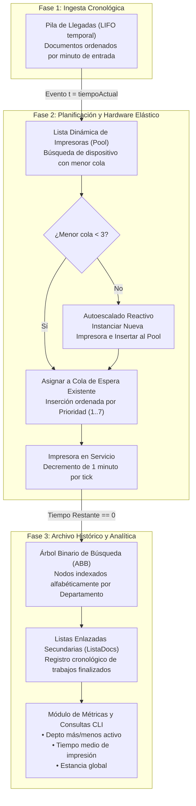
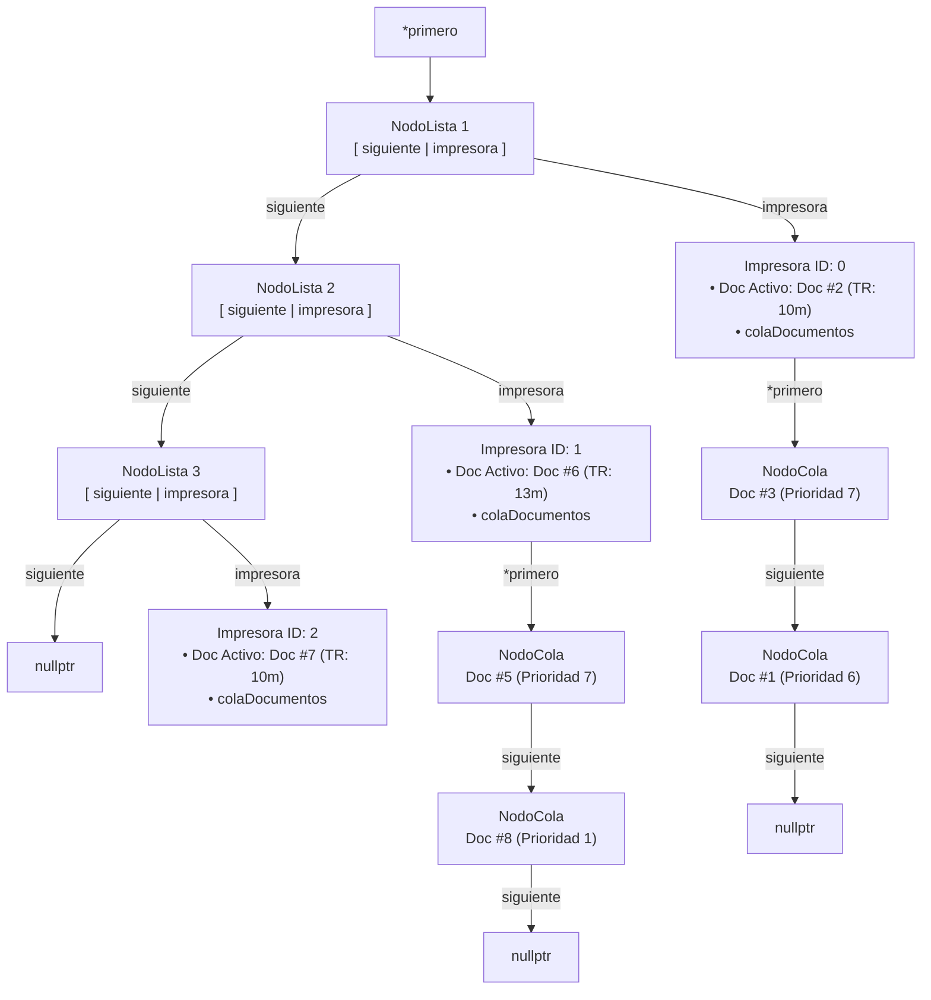
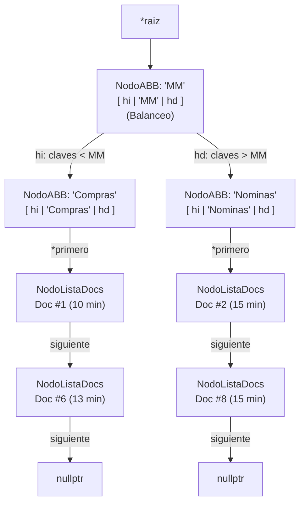

# Simulador de Spooler de Impresión Concurrente y Analítica Departamental en C++

[](https://en.wikipedia.org/wiki/C%2B%2B11)
[](#5-catálogo-de-tipos-abstractos-de-datos-tads)
[](#8-guía-de-compilación-y-ejecución)
[](#6-análisis-formal-de-complejidad-algorítmica-big-o)
[](#2-contexto-académico-y-trazabilidad)

> **Simulador de eventos discretos en tiempo real para la planificación concurrente de trabajos de impresión corporativos, balanceo de carga reactivo sobre hardware elástico y minería analítica departamental basada en árboles binarios de búsqueda autobalanceados mediante centinelas.**

---

## Ficha Técnica

| Dimensión Técnica | Especificación de la Implementación |
| :--- | :--- |
| **Lenguaje** | C++ puro (estándar C++11), Programación Orientada a Objetos (POO) desacoplada. |
| **Gestión de Memoria** | **100% manual**: asignación y liberación dinámica en heap (`new` / `delete`), sin dependencia de contenedores de la STL (`std::vector`, `std::list`, `std::queue`). |
| **Ciclo de Vida** | Implementación de la *Rule of Three*: constructores de copia profunda, operadores de asignación y destructores recursivos libres de fugas de memoria. |
| **Estructuras de Datos Implementadas** | Pila cronológica (LIFO), Cola de espera con prioridad por niveles (1 a 7), Lista dinámica de dispositivos, Árbol Binario de Búsqueda (ABB) departamental y Listas enlazadas secundarias (`ListaDocs`). |
| **Simulación** | Motor de eventos discretos por minutos cronológicos (arranque a las 07:00 / minuto 0) con resolución determinista de empates de llegada. |
| **Escalabilidad** | Detección de saturación por umbral: autoescalado reactivo de hardware instanciando nuevas impresoras elásticas cuando las colas activas alcanzan $\ge 3$ documentos. |
| **Herramientas de Compilación** | Triple soporte interoperable: `Makefile` (GNU Make), `CMakeLists.txt` (CMake 3.10+) y proyecto limpio `EstructurasDeDatos.cbp` (Code::Blocks). |

---

## 1. Descripción General del Problema y Modelo de Simulación

En un entorno corporativo con múltiples unidades de negocio (Compras, Dirección, Nóminas, Ventas), las peticiones de impresión compiten continuamente por los recursos físicos de salida. Un modelo de gestión simple (como un despacho secuencial FIFO simple) provoca cuellos de botella: documentos urgentes de Dirección quedan bloqueados tras informes extensos de rutina, y los picos de tráfico saturan el equipamiento disponible.

Este proyecto implementa una **solución integral de spooler inteligente** modelada mediante simulación de eventos discretos por minutos.

### Reglas de Negocio del Sistema
1. **Llegada Cronológica:** Cada documento entra al sistema con un identificador unívoco, minuto de emisión, tiempo estimado de impresión, departamento emisor y nivel de prioridad formal.
2. **Prioridad por Departamento:** Los trabajos se clasifican en una escala de prioridades de 1 a 7. Ante colas de espera con múltiples trabajos, el planificador despacha preferentemente los de mayor nivel de prioridad (ej. Dirección con nivel 7 tiene preferencia sobre Nóminas con nivel 1).
3. **Balanceo de Carga y Autoescalado Elástico:**
   - Cuando llega un documento, el sistema evalúa la carga de todo el parque de impresoras disponibles.
   - Si la impresora con menor cola tiene **menos de 3 documentos en espera**, el trabajo se le asigna directamente.
   - Si todas las impresoras activas tienen **3 o más documentos en cola**, el sistema detecta congestión de red y procede automáticamente al **autoescalado**, instanciando e integrando una nueva impresora al pool en tiempo de ejecución.
4. **Archivo y Agregación Analítica:** En el instante exacto en que una impresora concluye un trabajo, el documento se desvincula de la cola física y se inserta automáticamente en un **Árbol Binario de Búsqueda (ABB)** ordenado lexicográficamente por departamento, permitiendo auditorías estadísticas instantáneas.

---

## 2. Contexto Académico y Trazabilidad

### 2.1. Contexto Académico y Autoría
* **Proyecto desarrollado por:** Iván Collado y David Martínez.
* **Titulación:** Grado en Ingeniería en Sistemas de Información (GISI).
* **Institución:** Escuela Politécnica Superior — Universidad de Alcalá (UAH).
* **Asignatura:** Estructuras de Datos (Prácticas PL1 y PL2, Curso 24-25).

### 2.2. Trazabilidad, Privacidad y Organización para GitHub
> [!NOTE]
> **Trazabilidad, Privacidad y Organización para GitHub:**  
> Este módulo conserva al 100% el diseño conceptual del código, las decisiones de modelado y la aplicación desarrollada y evaluada durante la carrera universitaria.  
> Con el fin de adaptarlo a los estándares de publicación en código abierto y portafolios técnicos:
> * **Propiedad Intelectual y Privacidad Académica:** No se han incluido los documentos PDF oficiales del enunciado de la práctica por estricto respeto a los derechos de propiedad intelectual del profesorado y de la **Universidad de Alcalá (UAH)**, así como a la normativa de protección de datos personales. En su lugar, toda la especificación técnica, reglas de negocio, requerimientos de los TADs y los 17 casos de prueba oficiales han sido sintetizados y documentados con redacción propia a lo largo de este archivo.
> * **Refactorización y Estandarización de Calidad:** Se desacopló el código en una jerarquía limpia de cabeceras (`include/`) e implementaciones (`src/`), se dotó al proyecto de un triple sistema de compilación interoperable (`Makefile`, `CMakeLists.txt` y `EstructurasDeDatos.cbp`), y se subsanaró un errore de gestión de memoria garantizando liberación recursiva en destructores).
> * **Fidelidad al Proyecto Académico Original:** Se mantienen íntegramente las estructuras de datos, las relaciones entre clases, los algoritmos de ordenación cronológica y por prioridad, el autoescalado reactivo ante colas saturadas ($\ge 3$ documentos) y el esquema de indexación en el Árbol Binario de Búsqueda (ABB) mediante el nodo raíz centinela `"MM"`.

---

## 3. Arquitectura del Sistema y Flujo de Datos

El diseño arquitectónico se divide en tres capas desacopladas que transforman secuencialmente los datos conforme avanza el reloj de la simulación:



### Topología y Conexión de Punteros en Memoria Dinámica (Heap)

A continuación se ilustra visualmente la topología de los nodos interconectados mediante punteros dinámicos durante la ejecución de la simulación, estructurada verticalmente en sus dos subsistemas de memoria principales:

#### 1. Pool Dinámico de Impresoras (Lista 1-indexada) y Colas de Prioridad
Representa la infraestructura activa de hardware en el heap. La lista dinámica enlaza las impresoras en servicio, y cada una gestiona su propia cola enlazada con prioridad descendente:



#### 2. Árbol Binario de Búsqueda (ABB) Departamental y Listas de Historial (ListaDocs)
Representa la estructura de archivo analítico en el heap. El árbol bifurca lexicográficamente respecto al centinela `"MM"`, y cada nodo departamental es cabecera de su propia lista enlazada de documentos finalizados:



---

## 4. Especificación de Requisitos y Casos de Prueba Oficiales

### 4.1. Atributos de la Entidad `Documento`
Cada trabajo de impresión se modela como un objeto inmutable con 6 atributos fundamentales:
* **`idDocumento` (`int`):** Identificador entero secuencial único.
* **`tiempoLlegada` (`int`):** Minutos transcurridos desde el arranque del sistema a las 07:00 (ej. $t = 15 \to 07:15$).
* **`tiempoImpresion` (`int`):** Duración neta requerida por el cabezal de impresión para completar el trabajo (en minutos).
* **`departamento` (`std::string`):** Unidad organizativa remitente (`Compras`, `Direccion`, `Nominas`, `Ventas`).
* **`prioridad` (`int`):** Nivel de urgencia formal en escala ordinal de 1 a 7 (7 máxima prioridad, 1 mínima prioridad).
* **`idImpresora` (`int`):** Identificador de la máquina física que procesó o tiene asignado el documento (inicialmente `-1` si no está asignada).

### 4.2. Banco Oficial de Datos de Prueba (17 Documentos Preconfigurados)
El sistema incluye la carga predeterminada de 17 documentos heterogéneos diseñados específicamente para forzar la concurrencia temporal y la saturación de colas:

| ID | Minuto Llegada | Hora Reloj | Tiempo Impresión | Departamento | Nivel Prioridad | Comportamiento Esperado |
| :---: | :---: | :---: | :---: | :---: | :---: | :--- |
| **1** | 0 | 07:00 | 10 min | Compras | 6 | Asignado a cola de espera en Impresora 0. |
| **2** | 0 | 07:00 | 15 min | Nóminas | 1 | Toma servicio inmediato en Impresora 0. |
| **3** | 5 | 07:05 | 29 min | Dirección | 7 | Encola en Impresora 0; prioridad 7 supera a Doc 1 (prioridad 6). |
| **4** | 7 | 07:07 | 8 min | Ventas | 5 | Encola en Impresora 0; cola alcanza longitud 3 (umbral de saturación). |
| **5** | 9 | 07:09 | 16 min | Dirección | 7 | Llega concurrente con Doc 6. |
| **6** | 9 | 07:09 | 13 min | Compras | 6 | Impresora 0 saturada $\to$ **Autoescalado: Instancia Impresora 1**. |
| **7** | 10 | 07:10 | 10 min | Compras | 6 | Llega concurrente con Docs 8 y 13. |
| **8** | 10 | 07:10 | 15 min | Nóminas | 1 | Encola por prioridad en Impresora 1. |
| **9** | 15 | 07:15 | 29 min | Dirección | 7 | Concurrencia con Doc 14. Encola en Impresora 2. |
| **10** | 17 | 07:17 | 8 min | Ventas | 5 | Concurrencia con Doc 15. Encola en Impresora 2. |
| **11** | 19 | 07:19 | 16 min | Dirección | 7 | Concurrencia con Docs 12, 16 y 17 (pico máximo de tráfico). |
| **12** | 19 | 07:19 | 13 min | Compras | 6 | Encola en Impresora 3. |
| **13** | 10 | 07:10 | 15 min | Nóminas | 1 | Encola en Impresora 1. |
| **14** | 15 | 07:15 | 29 min | Dirección | 7 | Encola en Impresora 2. |
| **15** | 17 | 07:17 | 8 min | Ventas | 5 | Encola en Impresora 0 (liberada tras finalizar Doc 2 y 3). |
| **16** | 19 | 07:19 | 16 min | Dirección | 7 | Encola en Impresora 3. |
| **17** | 19 | 07:19 | 13 min | Compras | 6 | Impresoras 0, 1 y 2 saturadas $\to$ **Autoescalado: Instancia Impresora 3**. |

---

## 5. Catálogo de Tipos Abstractos de Datos (TADs)

Toda la infraestructura de datos se ha desarrollado desde cero sin recurrir a la STL, encapsulando memoria y responsabilidades, tal y como se exigía obligatoriamente en el enunciado:

### 1. `Pila` (Stack LIFO Cronológico)
* **Responsabilidad:** Almacén temporal de trabajos pendientes de ingresar a la red.
* **Invariante:** Los documentos se ordenan en orden cronológico inverso, de modo que la cima (`cima`) contiene siempre el trabajo con menor minuto de llegada.
* **Operaciones Clave:** `apilar`, `desapilar`, `apilarTiempo` (inserción ordenada asistida por pila auxiliar).

### 2. `Cola` (Queue con Prioridad por Niveles)
* **Responsabilidad:** Cola de espera individual de cada impresora.
* **Invariante:** Los documentos se ordenan de mayor a menor prioridad ($7 \to 1$). Ante empate de prioridad, rige el orden de llegada (*FIFO intra-prioridad*).
* **Operaciones Clave:** `encolar`, `desencolar`, `encolarPrioridad` (reordenamiento ordenado mediante transferencia auxiliar).

### 3. `Lista` (Lista Enlazada de Impresoras)
* **Responsabilidad:** Administrador del conjunto elástico de hardware.
* **Diseño:** Lista simplemente enlazada 1-indexada con punteros a `primero` y `ultimo`.
* **Operaciones Clave:** `insertarDere`, `verPosicion`, `borrarPosicion`, `getLongitudLista`.

### 4. `ABB` (Árbol Binario de Búsqueda Departamental)
* **Responsabilidad:** Repositorio analítico de documentos completados.
* **Diseño:** Árbol binario enlazado ordenado lexicográficamente por el nombre del departamento.
* **Estrategia del Nodo Centinela `"MM"`:** La raíz se inicializa con la clave ficticia `"MM"`. Puesto que en el alfabeto español la mitad lexicográfica se sitúa en torno a la letra M, los departamentos que empiezan por C y D se ramifican automáticamente a la izquierda (`hi`), mientras que N y V lo hacen a la derecha (`hd`), garantizando un árbol naturalmente equilibrado sin sobrecoste de rotaciones AVL.
* **Operaciones Clave:** `insertarDocumento`, `buscarPorDepartamento`, `obtenerDeptoMasUsado`, `obtenerDeptoMenosUsado`, `mostrarTiemposMediosDeptos`.

### 5. `ListaDocs` (Lista de Documentos Finalizados)
* **Responsabilidad:** Colección enlazada anidada en cada nodo del ABB que preserva la secuencia histórica de documentos procesados para ese departamento.

### 6. `Impresora`
* **Responsabilidad:** Modelo del dispositivo físico. Gestiona el documento en servicio, el contador de tiempo restante y su cola de espera privada `Cola`.

### 7. `Sistema`
* **Responsabilidad:** Controlador maestro de la simulación. Coordina el avance del reloj (`simularUnMinuto`, `simularTodo`), la ingesta desde la `Pila`, el balanceo de carga en `Lista` y el archivo en `ABB`.

---

## 6. Análisis Formal de Complejidad Algorítmica (Big-O)

A continuación se resume el coste asintótico formal de las operaciones más relevantes del sistema, donde:
* $N$: Total de documentos procesados en la simulación ($N = 17$).
* $P$: Número de impresoras elásticas instanciadas en el pool ($P \le 4$).
* $C$: Capacidad máxima de la cola de espera de una impresora ($C \le 3$).
* $D$: Número de departamentos empresariales registrados ($D = 4$).

| TAD / Estructura | Operación Clave | Mejor Caso (Tiempo) | Caso Promedio (Tiempo) | Peor Caso (Tiempo) | Complejidad Espacial |
| :--- | :--- | :---: | :---: | :---: | :---: |
| **`Pila`** | `apilar(doc)` | $\mathcal{O}(1)$ | $\mathcal{O}(1)$ | $\mathcal{O}(1)$ | $\mathcal{O}(1)$ |
| **`Pila`** | `desapilar()` | $\mathcal{O}(1)$ | $\mathcal{O}(1)$ | $\mathcal{O}(1)$ | $\mathcal{O}(1)$ |
| **`Pila`** | `apilarTiempo(doc)` | $\mathcal{O}(1)$ | $\mathcal{O}(N)$ | $\mathcal{O}(N)$ | $\mathcal{O}(N)$ (auxiliar) |
| **`Cola`** | `encolar(doc)` / `desencolar()` | $\mathcal{O}(1)$ | $\mathcal{O}(1)$ | $\mathcal{O}(1)$ | $\mathcal{O}(1)$ |
| **`Cola`** | `encolarPrioridad(doc)` | $\mathcal{O}(1)$ | $\mathcal{O}(C)$ | $\mathcal{O}(C)$ | $\mathcal{O}(C)$ |
| **`Lista`** | `verPosicion(i)` | $\mathcal{O}(1)$ | $\mathcal{O}(P)$ | $\mathcal{O}(P)$ | $\mathcal{O}(1)$ |
| **`Lista`** | `insertarDere(imp)` | $\mathcal{O}(1)$ | $\mathcal{O}(1)$ | $\mathcal{O}(1)$ | $\mathcal{O}(1)$ |
| **`ABB`** | `insertarDocumento(depto)` | $\mathcal{O}(1)$ | $\mathcal{O}(\log D)$ | $\mathcal{O}(D)$ | $\mathcal{O}(\log D)$ |
| **`ABB`** | `buscarPorDepartamento(d)` | $\mathcal{O}(1)$ | $\mathcal{O}(\log D)$ | $\mathcal{O}(D)$ | $\mathcal{O}(\log D)$ |
| **`ABB`** | `obtenerDeptoMas/MenosUsado` | $\mathcal{O}(D)$ | $\mathcal{O}(D)$ | $\mathcal{O}(D)$ | $\mathcal{O}(\log D)$ |
| **`ABB`** | `mostrarEnOrden()` | $\mathcal{O}(D)$ | $\mathcal{O}(D)$ | $\mathcal{O}(D)$ | $\mathcal{O}(\log D)$ |
| **`Sistema`** | `simularUnMinuto()` | $\mathcal{O}(P)$ | $\mathcal{O}(P + \log D)$ | $\mathcal{O}(P + D)$ | $\mathcal{O}(1)$ |

> **Nota sobre la complejidad práctica:** Debido al umbral de saturación $C < 3$ impuesto por la política de autoescalado, las operaciones sobre la cola de prioridad se ejecutan en tiempo estrictamente constante en la práctica ($\mathcal{O}(1)$ amortizado), garantizando un rendimiento óptimo en sistemas embebidos o de recursos limitados.

---

## 7. Manual de la Consola Interactiva (CLI)

El ejecutable presenta un menú estructurado con 15 opciones numéricas clasificadas por área funcional:

```text
=====================================================================
                        SISTEMA DE IMPRESORAS                        
=====================================================================
1.  Crear pila de documentos
2.  Mostrar pila de documentos
3.  Borrar pila de documentos
4.  Simular avance de N minutos
5.  Mostrar estado de impresoras
6.  Consultar impresora menos y mas ocupada
7.  Consultar numero de impresoras en funcionamiento
8.  Simular todo el proceso de impresion
9.  Anadir documento al arbol de documentos impresos
10. Mostrar arbol de documentos impresos
11. Mostrar documentos de un departamento
12. Mostrar departamentos que han impreso documentos
13. Departamento que ha utilizado mas/menos la red
14. Tiempo medio de impresion de un departamento
15. Mostrar tiempo medio de impresion de cada departamento
0.  Salir
======================================================================
```

### Bloques Funcionales del Menú

#### A. Gestión de Documentos de Entrada (Opciones 1 a 3)
* **Opción 1:** Carga e inicializa en memoria la Pila con los 17 documentos oficiales.
* **Opción 2:** Inspecciona la Pila mostrando el estado y atributos de todos los trabajos en espera.
* **Opción 3:** Vacía y libera completamente la Pila de llegada.

#### B. Control del Motor de Simulación (Opciones 4 a 8)
* **Opción 4:** Avanza el reloj de la simulación $N$ minutos especificados por teclado, mostrando eventos paso a paso.
* **Opción 5:** Despliega el estado de todas las impresoras del pool (documento activo, tiempo restante y cola).
* **Opción 6:** Muestra de forma inmediata los identificadores de la impresora más saturada y la menos ocupada.
* **Opción 7:** Indica la cantidad de máquinas actualmente en servicio activo (ocupadas).
* **Opción 8:** **Simulación Completa:** Ejecuta el ciclo continuo hasta procesar el 100% de los documentos, reportando el tiempo medio de estancia global en el sistema.

#### C. Analítica y Minería sobre el ABB (Opciones 9 a 15)
* **Opción 9:** Permite insertar manualmente un documento personalizado en el árbol sin pasar por la simulación.
* **Opción 10:** Recorrido In-Orden del ABB, desplegando el historial completo de impresiones por departamento.
* **Opción 11:** Búsqueda binaria para mostrar los documentos impresos por una unidad concreta (ej. `Compras`).
* **Opción 12:** Lista en orden alfabético todos los departamentos que han utilizado la red.
* **Opción 13:** Determina analíticamente qué departamento ha consumido más recursos y cuál menos.
* **Opción 14:** Calcula la media exacta de tiempo de impresión de un departamento consultado por teclado.
* **Opción 15:** Emite el informe consolidado con las medias de tiempo de todos los departamentos registrados en el ABB.

---

## 8. Guía de Compilación y Ejecución

El proyecto ofrece un triple sistema de construcción compatible con cualquier entorno de desarrollo moderno:

### Opción A: Compilación rápida con GNU Make (Recomendado para Terminal)
Requiere `make` y `g++` (MinGW, GCC en Linux o WSL):
```bash
# Compilar proyecto optimizado (genera bin/sistema_impresoras.exe)
make

# Ejecutar la aplicación
./bin/sistema_impresoras.exe

# Limpiar objetos y binarios generados
make clean
```

### Opción B: Compilación multiplataforma con CMake (VS Code, CLion)
```bash
# Generar archivos de build
cmake -B build -S .

# Compilar ejecutable
cmake --build build --config Release

# Ejecutar
./build/sistema_impresoras
```

### Opción C: Code::Blocks IDE
1. Abrir Code::Blocks.
2. Ir a **File $\to$ Open...** y seleccionar `EstructurasDeDatos.cbp`.
3. Seleccionar el target **Release** o **Debug** y pulsar **Build and Run** (`F9`).  

---

## 9. Aviso de Integridad Académica y Exención de Responsabilidad (Disclaimer)

> [!IMPORTANT]
> ### Declaración de Uso Formativo, Propiedad Intelectual y Garantías
> 
> * **Finalidad Formativa y de Portafolio:**  
>   Este repositorio se publica exclusivamente con fines educativos, de divulgación técnica y como parte del portafolio profesional de sus autores para exhibir competencias prácticas en programación en C++, diseño de Tipos Abstractos de Datos (TADs), gestión manual de memoria dinámica con punteros y análisis de complejidad algorítmica.
> 
> * **Integridad Académica y Código de Honor:**  
>   El código, los esquemas y las especificaciones aquí expuestos corresponden al trabajo original desarrollado por los autores durante sus estudios de grado en la **Universidad de Alcalá (UAH)**. **No se autoriza su reproducción, copia o entrega total o parcial** para la evaluación en asignaturas universitarias presentes o futuras. Los autores se desvinculan expresamente de cualquier uso indebido, no ético o contrario a los códigos de honor universitarios que terceros puedan hacer de este material.
> 
> * **Garantía y Responsabilidad Técnica (*AS-IS*):**  
>   El software, estructuras y scripts de construcción se proporcionan *"tal cual"* (*AS-IS*), con fines demostrativos y académicos, sin garantías expresas o implícitas respecto a su aplicabilidad en entornos productivos comerciales.