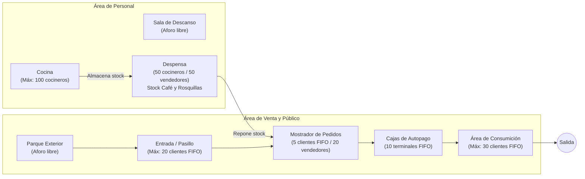
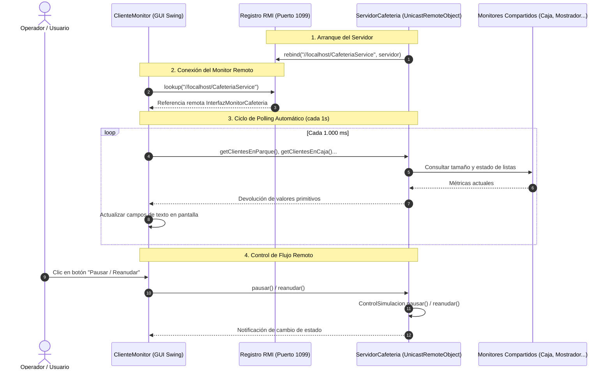
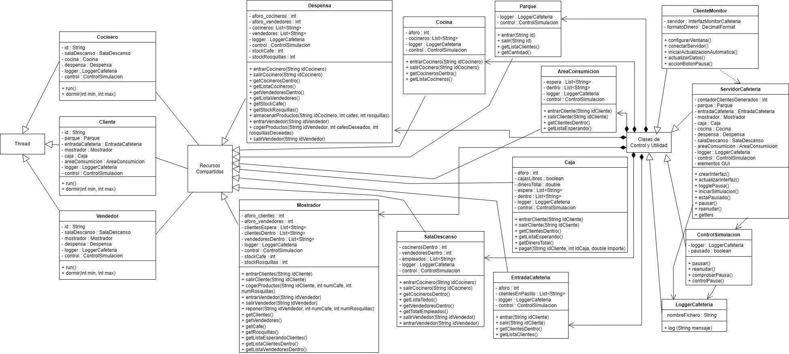

# Simulador Concurrente y Distribuido de Cafetería en Java

[](https://openjdk.org/)
[](#5-análisis-de-concurrencia-sincronización-y-retos-técnicos-resueltos)
[](#3-arquitectura-concurrente-y-distribuida)
[](#6-manual-de-las-interfaces-gráficas-servidor-y-monitor-remoto)
[](#7-guía-de-compilación-y-ejecución)
[](#2-contexto-académico-y-trazabilidad)

> **Sistema de simulación en tiempo real que modela la actividad y concurrencia de una cafetería de alta demanda (8.000 clientes, 500 cocineros y 500 vendedores). El proyecto combina sincronización estricta mediante monitores, colas justas con política FIFO (`ReentrantLock`), control global de flujo (pausa y reanudación reactiva) y una capa de supervisión desacoplada mediante invocación a métodos remotos con Java RMI.**

---

## Ficha Técnica

| Dimensión Técnica                | Especificación de la Implementación                                                                                                                                                            |
| :------------------------------- | :--------------------------------------------------------------------------------------------------------------------------------------------------------------------------------------------- |
| **Lenguaje y Entorno**           | Java SE 21 puro, Programación Concurrente y Orientada a Objetos (POO).                                                                                                                         |
| **Modelo de Concurrencia**       | Multihilo nativo (`Thread`), con hilos independientes para cada cliente, cocinero y vendedor.                                                                                                  |
| **Mecanismos de Sincronización** | Doble estrategia: cerrojos con equidad (`ReentrantLock(true)`) para acceso FIFO por orden de llegada y monitores clásicos (`synchronized`, `wait()`, `notifyAll()`) para aforos e inventarios. |
| **Control de Flujo Global**      | Monitor centralizado de pausa (`ControlSimulacion`) que suspende y reactiva la ejecución coordinada de todos los hilos sin pérdida de estado.                                                  |
| **Arquitectura Distribuida**     | Java Remote Method Invocation (RMI) sobre el registro local (puerto `1099`), desacoplando el núcleo de simulación del visor de monitorización.                                                 |
| **Interfaz Gráfica (GUI)**       | Doble ventana interactiva en Java Swing: panel del servidor con seguimiento visual de todas las estancias y panel del cliente remoto con sondeo (_polling_) periódico cada 1 segundo.          |
| **Persistencia y Registro**      | Monitor de log concurrente (`LoggerCafeteria`) que registra cronológicamente cada evento con marca de tiempo en consola y fichero de texto (`evolucion_cafeteria.txt`).                        |
| **Construcción y Ejecución**     | Compatible con Apache Maven (`pom.xml`), compilación directa con `javac` y script automatizado para Windows (`ejecutar_sistema.bat`).                                                          |

---

## 1. Descripción General del Problema y Reglas del Sistema

En un negocio de hostelería con gran afluencia de público conviven flujos constantes de producción, abastecimiento, atención al público y cobro. Sin un control riguroso de concurrencia se producen condiciones de carrera (ventas de productos agotados, desajustes en la recaudación) o cuellos de botella y bloqueos (aglomeraciones que saturan el paso o trabajadores esperando recursos de forma desordenada).

Este proyecto simula de forma visual y reproducible el ciclo de vida completo de una cafetería mediante actores autónomos y áreas de actividad compartidas.



### Reglas de Negocio del Sistema

1. **Generación Concurrente Escalonada:**
   - **8.000 Clientes:** Se incorporan de manera escalonada en intervalos aleatorios de 1 a 3 segundos, identificados como `C-0001` a `C-8000`.
   - **500 Cocineros:** Se crean de forma simultánea en intervalos de 1 a 2 segundos, identificados como `B-0001` a `B-0500`.
   - **500 Vendedores:** Se incorporan en intervalos de 0,5 a 2,5 segundos, identificados como `V-0001` a `V-0500`.
2. **Ciclo de los Clientes:**
   - Pasan de 5 a 10 segundos en el parque contemplando el entorno antes de caminar hacia la cafetería (3 a 9 segundos).
   - Si el pasillo de entrada no está lleno (aforo máximo de 20 personas), entran y esperan ordenadamente para acceder al mostrador.
   - En el mostrador (máximo 5 clientes simultáneos), eligen aleatoriamente entre 1 y 3 cafés y entre 0 y 4 rosquillas. Si no hay existencias suficientes de alguno de los productos, esperan hasta que un vendedor reponga.
   - Pasan a la zona de cajas (10 terminales de autopago por orden de llegada) donde abonan el importe exacto (1,50 € por café y 2,50 € por rosquilla). El pago requiere entre 2 y 5 segundos y se suma a la recaudación global compartida.
   - Acceden al área de consumición (aforo máximo de 30 personas) donde permanecen entre 10 y 15 segundos antes de abandonar el establecimiento y dar por finalizado su hilo.
3. **Ciclo de los Cocineros (Productores):**
   - Descansan entre 5 y 10 segundos en la sala de descanso, se desplazan a la cocina (1 a 3 segundos) y elaboran entre 2 y 5 cafés y entre 4 y 8 rosquillas (tiempo de preparación de 5 a 10 segundos).
   - Llevan los productos a la despensa (2 a 5 segundos), donde los almacenan y notifican a los vendedores. Regresan al descanso y repiten el ciclo de forma indefinida.
4. **Ciclo de los Vendedores (Reponedores / Intermediarios):**
   - Tras descansar de 5 a 10 segundos, van a la despensa (1 a 3 segundos) y seleccionan entre 3 y 6 cafés y entre 5 y 10 rosquillas. Si la despensa no tiene suficientes unidades de ambos artículos, esperan la llegada de los cocineros.
   - Transportan la mercancía al mostrador (2 a 5 segundos) y la colocan en las estanterías (1 a 3 segundos), notificando a los clientes que estuvieran esperando existencias. Regresan a la sala de descanso y repiten el ciclo continuamente.

---

## 2. Contexto Académico y Trazabilidad

### 2.1. Contexto Académico y Autoría

- **Proyecto desarrollado por:** Iván Collado y David Martínez.
- **Titulación:** Grado en Ingeniería en Sistemas de Información (GISI).
- **Institución:** Escuela Politécnica Superior — Universidad de Alcalá (UAH).
- **Asignatura:** Paradigmas de Programación (Curso 2025/2026).

### 2.2. Trazabilidad, Privacidad y Organización para GitHub

> [!NOTE] 
> **Trazabilidad, Privacidad y Organización para GitHub:**  
> Este módulo conserva íntegramente la lógica interna, el modelo de sincronización y las decisiones de diseño evaluadas durante la carrera universitaria.  
> Con el fin de adaptar el proyecto a estándares de código abierto y portafolios técnicos:
>
> - **Propiedad Intelectual y Normativa Académica:** Se ha omitido el documento PDF original del enunciado oficial para respetar los derechos de propiedad intelectual del cuerpo docente de la Universidad de Alcalá. Todos los requisitos y reglas de negocio se han documentado con redacción propia a lo largo de este archivo.
> - **Protección de Datos Personales:** Se eliminó la memoria en formato PDF que contenía los números de DNI de los autores en portada, trasladando sus explicaciones técnicas, diagramas y retos resueltos directamente a esta documentación Markdown.
> - **Estandarización de Directorios:** Se eliminaron las carpetas intermedias de entrega de la plataforma docente (`PECL1_...`), aplanando el proyecto en una estructura estándar de Maven bajo `03-paradigmas-programacion`.
> - **Fidelidad al Código Evaluado:** Se mantiene el 100% del código fuente entregado, incluyendo los mecanismos de sincronización, la gestión del control de pausa y la arquitectura RMI.

---

## 3. Arquitectura Concurrente y Distribuida

El sistema se estructura en dos subsistemas principales: el **Servidor de Simulación Local** (que alberga el motor multihilo y los monitores de estado) y el **Cliente Monitor Remoto** (que consulta métricas y gestiona el flujo mediante invocación remota).

### 3.1. Esquema de Comunicación Distribuida (Java RMI)



### 3.2. Diagrama de Clases UML del Sistema

A continuación se muestra el plano conceptual de relaciones entre actores activos, recursos compartidos y capa de control:



---

## 4. Catálogo de Clases y Responsabilidades

Toda la lógica del sistema está estructurada en paquetes claros siguiendo el principio de responsabilidad única:

### Actores Multihilo (`Thread`)

- **`Cliente`:** Modela el ciclo de vida completo de cada usuario consumidor. Gestiona el paso secuencial por el parque, la entrada al pasillo, la selección de cafés y rosquillas en el mostrador, el abono en caja y la estancia en el área de consumición.
- **`Cocinero`:** Hilo productor con ciclo continuo. Alterna el descanso con la elaboración de stock en la cocina y su posterior traslado seguro a la despensa.
- **`Vendedor`:** Hilo intermediario con ciclo continuo. Retira café y rosquillas de la despensa y abastece el mostrador para satisfacer la demanda de los clientes.

### Recursos Compartidos y Monitores

- **`EntradaCafeteria`:** Monitor de acceso al establecimiento. Controla el aforo máximo de 20 clientes en el pasillo previo a la atención.
- **`Mostrador`:** Monitor central de servicio. Regula el acceso de hasta 5 clientes por orden de llegada y hasta 20 vendedores. Gestiona el stock disponible para despacho inmediato y suspende a los clientes cuando las existencias son insuficientes hasta que se recibe una reposición.
- **`Caja`:** Monitor financiero y de cobro. Dispone de 10 puestos de autopago individuales atendidos por riguroso orden FIFO y acumula la recaudación total en la variable compartida `dineroTotal`.
- **`AreaConsumicion`:** Monitor con aforo de 30 plazas donde los clientes toman asiento para consumir sus productos antes de marcharse.
- **`Cocina`:** Monitor de producción con capacidad para hasta 100 cocineros simultáneos.
- **`Despensa`:** Monitor de almacenamiento intermedio. Admite hasta 50 cocineros y 50 vendedores a la vez, gestionando las existencias de café y rosquillas preparadas.
- **`SalaDescanso`:** Monitor de aforo ilimitado donde el personal descansa entre turnos.
- **`Parque`:** Monitor pasivo que registra los clientes generados en espera exterior.

### Control, Utilidades y Distribución

- **`ControlSimulacion`:** Monitor maestro de pausa y reanudación. Proporciona el método `comprobarPausa()` consultado por todos los hilos antes de cada acción crítica.
- **`LoggerCafeteria`:** Monitor de persistencia y trazabilidad. Añade marcas de tiempo y escribe los eventos concurrentes en consola y en el archivo `evolucion_cafeteria.txt` evitando la mezcla de líneas gracias a métodos sincronizados.
- **`ServidorCafeteria`:** Clase principal del servidor. Inicializa los monitores, arranca la interfaz gráfica local, publica el objeto en el registro RMI (`LocateRegistry`) y dispara los generadores de hilos.
- **`ClienteMonitor`:** Aplicación de supervisión remota en Swing que se enlaza vía `Naming.lookup` al servidor y consulta periódicamente las estadísticas del sistema.
- **`InterfazMonitorCafeteria`:** Interfaz remota Java RMI (`extends Remote`) que define el contrato de métodos de lectura y control entre cliente y servidor.

---

## 5. Análisis de Concurrencia, Sincronización y Retos Técnicos Resueltos

Durante el desarrollo de una simulación de esta escala surgieron retos de concurrencia avanzados que condicionaron el diseño arquitectónico:

### 5.1. Selección de Mecanismos: `ReentrantLock(true)` vs `synchronized`

Se implementó una estrategia mixta según los requisitos funcionales de cada estancia:

- **Zonas con Justicia Estricta (FIFO):** En `Caja`, `Mostrador`, `AreaConsumicion` y `EntradaCafeteria` es indispensable atender a los clientes por orden de llegada. La sincronización nativa de Java (`synchronized`) no garantiza orden (despierta hilos de forma arbitraria), por lo que se utilizaron cerrojos explícitos `ReentrantLock(true)` combinados con objetos `Condition` (`hayHueco`, `colaClientes`, `esperaProductos`).
- **Zonas de Aforo sin Orden de Entrada:** En `Cocina`, `Despensa` y `SalaDescanso` no es prioritario el orden de llegada, sino garantizar el límite máximo de ocupación y la exclusión mutua. En estos casos se empleó la sincronización nativa mediante bloques y métodos `synchronized`, junto con `wait()` y `notifyAll()`.

### 5.2. Desafío Resuelto: Bloqueo de Monitor Anidado y Congelación de la GUI

- **El Problema:** Al pulsar el botón de pausa durante las pruebas iniciales, los hilos de los clientes se dormían dentro de monitores como `Caja` o `Mostrador` manteniendo adquirido su cerrojo. Al mismo tiempo, el hilo de eventos de Swing intentaba repintar la interfaz consultando los métodos getters de esas mismas clases. Al estar estos getters sincronizados, la GUI quedaba bloqueada esperando a que se liberara el cerrojo, congelando por completo la ventana de la aplicación.
- **La Solución:** Se retiró la sincronización bloqueante de los getters consultados por la GUI y RMI, permitiendo lecturas no bloqueantes del estado de las listas y contadores. Para evitar excepciones de concurrencia al recorrer las colecciones mientras otro hilo las modifica (`ConcurrentModificationException`), los monitores devuelven una captura instantánea (_snapshot_) de los identificadores convertida a cadena mediante listas sincronizadas y `String.join(", ", lista)`.

### 5.3. Resistencia ante Señales Redundantes: Guarded Wait con `while` en `Cliente.java`

- **Particularidad del Código Original:** En `Cliente.java`, el cliente invoca `entradaCafeteria.salir(id)` al conseguir hueco en el mostrador (para dejar libre su plaza en el pasillo) y vuelve a invocar `entradaCafeteria.salir(id)` al abandonar finalmente el edificio.
- **Por qué no afecta a la consistencia:** En la segunda llamada, `clientesEnPasillo.remove(id)` simplemente no encuentra el elemento y no realiza ninguna acción dañina. Aunque se emite una señal `hayHueco.signal()`, la entrada en `EntradaCafeteria.java` está protegida mediante el patrón canónico de **condición guardada**:
  ```java
  while (clientesEnPasillo.size() >= aforo) {
      hayHueco.await();
      control.comprobarPausa();
  }
  ```
  Al comprobarse la condición dentro de un bucle `while` (y no un `if`), cualquier hilo que reciba una señal redundante reevalúa inmediatamente la ocupación real del pasillo. Si el aforo está completo, vuelve a suspenderse de inmediato sin llegar a acceder jamás, garantizando que el límite de 20 clientes se mantenga inquebrantable en todo momento.

### 5.4. Ciclo de Vida Infinito de Personal y Terminación con `taskkill`

- Siguiendo la especificación literal del enunciado docente (_«Los cocineros/vendedores tendrán el siguiente ciclo de vida, que será repetido infinitamente»_), los hilos de empleados están diseñados como trabajadores de servicio continuo mediante bucles `while (true)`.
- Para ofrecer un cierre cómodo de todo el entorno sin requerir matar procesos manualmente en el administrador de tareas de Windows, el script `ejecutar_sistema.bat` mantiene el control de la consola y, al pulsar cualquier tecla, invoca `taskkill /F /IM javaw.exe`, finalizando de forma limpia tanto el servidor como el cliente monitor.

---

## 6. Manual de las Interfaces Gráficas (Servidor y Monitor Remoto)

El sistema provee dos interfaces gráficas desarrolladas con Java Swing:

### 1. Panel Principal del Servidor (`ServidorCafeteria`)

Se divide en dos columnas principales con refresco visual continuo cada 100 ms:

- **Cabecera de Control:** Botón superior para pausar o reanudar la simulación en caliente.
- **Columna Izquierda (Clientes y Flujo Público):**
  - _Parque:_ Clientes generados paseando en el exterior.
  - _Entrada Cafetería:_ Clientes en el pasillo de acceso (máx. 20).
  - _Esperando Mostrador y Mostrador:_ Clientes en cola y clientes seleccionando productos (máx. 5).
  - _Esperando Caja y Caja:_ Cola FIFO de pago y clientes en los 10 terminales de autopago.
  - _Área de Consumición:_ Clientes sentados tomando sus consumiciones (máx. 30).
  - _Recaudación:_ Importe total acumulado en euros con formato de moneda.
- **Columna Derecha (Empleados y Producción):**
  - _Cocina:_ Cocineros elaborando productos (máx. 100).
  - _Despensa:_ Registro de cocineros guardando stock, vendedores retirando stock y contadores de unidades de café y rosquillas almacenadas.
  - _Mostrador (Vendedores y Stock):_ Vendedores en reposición y existencias disponibles para venta inmediata.
  - _Sala de Descanso:_ Personal reponiendo fuerzas.

### 2. Panel del Cliente Monitor Remoto (`ClienteMonitor`)

Diseñado para terminales de supervisión o puestos de control independientes:

- Se conecta automáticamente a `//localhost/CafeteriaService` mediante Java RMI en el puerto 1099.
- Realiza consultas periódicas automatizadas cada 1.000 ms mediante un temporizador Swing, actualizando todos los aforos, existencias y recaudación sin que el usuario deba intervenir.
- Dispone de sincronización bidireccional en el botón de pausa: pausar la simulación desde el cliente remoto actualiza inmediatamente el color y texto tanto en el cliente como en la ventana del servidor local.

---

## 7. Guía de Compilación y Ejecución

El proyecto ofrece diversas alternativas de construcción según el entorno de trabajo:

### Requisitos Previos

- **Java Development Kit (JDK) versión 21 o superior** instalado y configurado en el sistema.
- _(Opcional)_ **Apache Maven 3.8+** configurado en el `PATH` para compilación estándar.

---

### Opción A: Lanzamiento Automatizado con Script (Recomendado en Windows)

El script `ejecutar_sistema.bat` compila el proyecto y lanza de forma secuencial el Servidor y el Monitor Remoto:

```cmd
ejecutar_sistema.bat
```

1. Detecta si Maven está disponible; si no lo está, compila de forma transparente directamente con `javac`.
2. Lanza el **Servidor** en una ventana independiente y espera 3 segundos a que el registro RMI se encuentre activo.
3. Lanza el **Cliente Monitor** conectado por RMI.
4. Para detener la simulación y cerrar todos los procesos, pulsa cualquier tecla en la ventana de la consola.

---

### Opción B: Compilación y Ejecución con Apache Maven

Desde el directorio `03-paradigmas-programacion/`:

```bash
# 1. Compilar clases del proyecto
mvn clean compile

# 2. Ejecutar la clase principal del Servidor
mvn exec:java

# 3. (En otra terminal) Ejecutar el Cliente Monitor
mvn exec:java -Dexec.mainClass="poo.peclcafeteria.ClienteMonitor"
```

---

### Opción C: Compilación Manual con `javac`

Si prefieres compilar sin herramientas de construcción:

```bash
# Compilar todas las clases hacia el directorio de salida
javac -d target/classes src/main/java/poo/peclcafeteria/*.java

# Terminal 1: Lanzar el Servidor
java -cp target/classes poo.peclcafeteria.ServidorCafeteria

# Terminal 2: Lanzar el Cliente Monitor Remoto
java -cp target/classes poo.peclcafeteria.ClienteMonitor
```

---

### Opción D: Entornos de Desarrollo Integrados (IDEs)

- **Apache NetBeans:** El proyecto incluye `nbactions.xml`. Basta con abrir la carpeta `03-paradigmas-programacion` como proyecto Maven y pulsar **Run Project** (`F6`).
- **IntelliJ IDEA / VS Code / Eclipse:** Abrir la carpeta raíz como proyecto Maven y ejecutar el método `main` de `ServidorCafeteria.java` y posteriormente de `ClienteMonitor.java`.

---

## 8. Aviso de Integridad Académica y Exención de Responsabilidad (Disclaimer)

> [!IMPORTANT]
>
> ### Declaración de Uso Formativo, Propiedad Intelectual y Garantías
>
> - **Finalidad Formativa y de Portafolio:**  
>   Este repositorio se publica exclusivamente con fines educativos, de divulgación técnica y como parte del portafolio profesional de sus autores para exhibir competencias prácticas en programación concurrente en Java, diseño de monitores con `ReentrantLock`, control de hilos y arquitectura distribuida con Java RMI.
>
> - **Integridad Académica:**  
>   El código y las especificaciones aquí expuestos corresponden al trabajo original desarrollado por los autores durante sus estudios de grado en la **Universidad de Alcalá (UAH)**. **No se autoriza su reproducción, copia o entrega total o parcial** para la evaluación en asignaturas universitarias presentes o futuras. Los autores se desvinculan expresamente de cualquier uso indebido, no ético o contrario a las normas universitarias que terceros puedan hacer de este material.
>
> - **Garantía y Responsabilidad Técnica (_AS-IS_):**  
>   El software, interfaces gráficas y scripts se proporcionan _"tal cual"_ (_AS-IS_), con fines demostrativos y académicos, sin garantías expresas o implícitas respecto a su aplicabilidad en entornos productivos comerciales.
