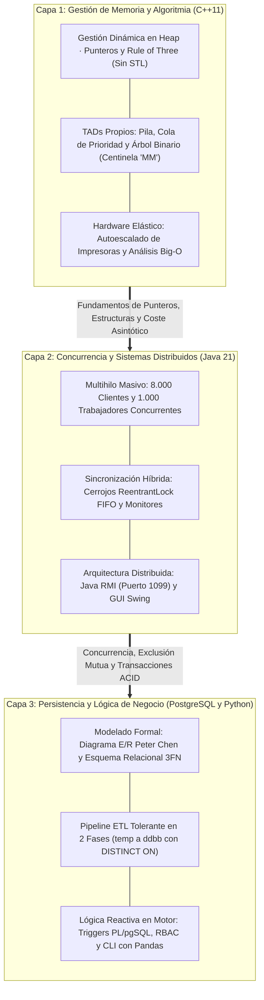

# Proyectos Académicos de Ingeniería del Software — UAH (GISI)

[-red.svg?logo=alcaladehenares&logoColor=white)](https://www.uah.es)
[-blue.svg)](https://portal.uah.es/portal/page/portal/posgrado/estudios_grado/ficha_grado?p_curso=2024&p_titulacion=G400)
[](#2-ecosistema-de-proyectos-de-la-memoria-a-la-persistencia)
[](#2-ecosistema-de-proyectos-de-la-memoria-a-la-persistencia)
[](https://github.com/ivii-devs)
[](#5-declaración-de-autoría-e-integridad-académica)

> **Monorepo que recopila los proyectos de desarrollo y arquitectura de software elaborados durante mi etapa universitaria en el Grado en Ingeniería en Sistemas de Información (GISI) por la Universidad de Alcalá (UAH). Este repositorio actúa como portafolio técnico transparente: cada módulo contiene código evaluado, sin plantillas automáticas ni atajos de librerías, demostrando desde el control de memoria en heap a bajo nivel con C++ hasta la concurrencia multihilo en Java y el diseño de pipelines de datos y lógica procedimental en PostgreSQL y Python.**

---

## Ficha Técnica del Repositorio

| Dimensión Técnica | Detalle del Portafolio Académico |
| :--- | :--- |
| **Autoría** | **Iván Collado** ([`@ivii-devs`](https://github.com/ivii-devs)) *(en coautoría con David Martínez en prácticas desarrolladas en equipo)*. |
| **Institución Académica** | Escuela Politécnica Superior — Universidad de Alcalá (UAH), Madrid, España. |
| **Titulación** | Grado en Ingeniería en Sistemas de Información (GISI). |
| **Lenguajes Dominados** | **C++** (estándar C++11), **Java** (Java SE 21), **Python** (3.10+), **SQL** (PostgreSQL 14+) y **PL/pgSQL**. |
| **Conocimientos** | Gestión manual de memoria en heap (sin STL), Programación Concurrente Multihilo (`Thread`, cerrojos `ReentrantLock`), Sistemas Distribuidos (Java RMI), Modelado de Datos (E/R Peter Chen y Relacional 3FN), Pipelines ETL transaccionales y Lógica de Negocio en Base de Datos (*triggers*). |
| **Proyecto Personal Vinculado (2026)** | [QuestFest](https://github.com/ivii-devs/questfest) — Aplicación web interactiva full-stack (Next.js, FastAPI, PostgreSQL, Docker) desarrollada en 2026 de forma paralela a este repositorio. |

---

## 1. Por qué este repositorio y qué vas a encontrar aquí

Cuando preparé mi currículum técnico para dar el salto al mercado profesional, me di cuenta de que sobre el papel es relativamente sencillo afirmar que dominas ciertas herramientas, lenguajes o conceptos teóricos. Sin embargo, me hice una pregunta clave: **¿cómo puedo marcar una diferencia real y demostrar de verdad esos conocimientos?** 

La respuesta fue crear este espacio: quise centralizar los mejores trabajos que he desarrollado a lo largo de toda mi carrera universitaria en un único repositorio monorepo público. De esta manera, cualquier persona puede entrar, inspeccionar el código fuente, comprobar las decisiones de diseño y validar empíricamente las competencias que defiendo en mi perfil.

Además, tengo la firme convicción de que, cuando comprendes de verdad qué ocurre por debajo de las abstracciones del software (cómo interactúa la memoria física en el heap, cómo evitar que dos hilos concurrentes caigan en una condición de carrera o un bloqueo mutuo, o cómo estructurar y normalizar un esquema relacional con lógica reactiva en base de datos), **transicionar y dominar cualquier framework moderno o nueva tecnología resulta mucho más natural, rápido y sólido**.

Este repositorio refleja precisamente ese principio. Poder contar con estos fundamentos me proporciona la base y la soltura necesarias para continuar aprendiendo nuevos frameworks, tecnologías o paradigmas y ampliar constantemente mis herramientas. Muestra de ello es el proyecto personal que desarrollé paralelamente a la preparación de este repositorio a fecha de 2026: [QuestFest](https://github.com/ivii-devs/questfest).

---

## 2. Ecosistema de Proyectos: De la Memoria a la Persistencia

Los tres proyectos están articulados como una progresión formativa y técnica deliberada que cubre desde el hardware y la memoria física hasta la arquitectura transaccional de datos:



A continuación se resume la ficha técnica de cada módulo, con enlace directo a su documentación completa:

| Módulo | Asignatura | Tecnologías | Problema Resuelto | Retos y Decisiones Clave | Documentación |
| :--- | :--- | :--- | :--- | :--- | :---: |
| [**`01-bases-de-datos/`**](01-bases-de-datos/) | **Bases de Datos** | PostgreSQL 14+<br/>PL/pgSQL<br/>Python 3.10+<br/>Pandas · Psycopg2 | Gestión y Analítica Histórica de Fórmula 1 | • Ingesta ETL tolerante en 2 fases (`temp` $\to$ `ddbb`).<br/>• Resolución determinista de unicidad con `DISTINCT ON`.<br/>• Triggers de auditoría y recálculo reactivo de puntos.<br/>• Políticas de mínimos privilegios (RBAC) y CLI interactiva. | [Ver README $\to$](01-bases-de-datos/README.md) |
| [**`02-estructuras-de-datos/`**](02-estructuras-de-datos/) | **Estructuras de Datos y Algoritmos** | C++11 puro<br/>GNU Make<br/>CMake 3.10+<br/>Code::Blocks | Simulador de Spooler de Impresión y Hardware Elástico | • Implementación manual de TADs (Pila, Cola, Lista, ABB).<br/>• Cero librerías STL: punteros manuales y *Rule of Three*.<br/>• Árbol ABB balanceado naturalmente con centinela `"MM"`.<br/>• Autoescalado reactivo al saturarse colas ($\ge 3$ documentos). | [Ver README $\to$](02-estructuras-de-datos/README.md) |
| [**`03-paradigmas-programacion/`**](03-paradigmas-programacion/) | **Paradigmas de Programación** | Java SE 21<br/>Java Swing<br/>Java RMI<br/>Apache Maven | Simulador Concurrente y Distribuido de Cafetería | • Concurrencia a escala: 8.000 clientes y 1.000 empleados.<br/>• Cerrojos con equidad `ReentrantLock(true)` (orden FIFO).<br/>• Monitor central de pausa y capturas sin congelar la GUI.<br/>• Monitor remoto distribuido vía Java RMI (puerto 1099). | [Ver README $\to$](03-paradigmas-programacion/README.md) |

---

## 3. Estructura Global del Repositorio

A continuación se detalla la organización de carpetas y archivos del monorepo:

```text
proyectos-universitarios-gisi-uah/
│
├── README.md                          <-- Portal principal de presentación e índice técnico del monorepo
├── .gitignore                         <-- Reglas de exclusión para C++, Java, Python, logs e IDEs
│
├── 01-bases-de-datos/                 <-- [PostgreSQL / PL/pgSQL / Python]
│   ├── README.md                      <-- Documentación técnica completa, modelos E/R y guía de uso
│   ├── data/                          <-- 10 datasets históricos de Fórmula 1 en formato CSV
│   ├── docs/                          <-- Diagrama Entidad-Relación y Modelo Relacional
│   ├── sql/
│   │   └── main.sql                   <-- Script maestro (DDL, carga ETL, triggers, tests, RBAC)
│   └── src/
│       ├── f1.py                      <-- Aplicación CLI interactiva con autenticación por roles
│       └── requirements.txt           <-- Dependencias de Python (psycopg2-binary, pandas)
│
├── 02-estructuras-de-datos/           <-- [C++11 Puro / Make / CMake]
│   ├── README.md                      <-- Documentación, diagramas de memoria en heap y análisis Big-O
│   ├── CMakeLists.txt                 <-- Configuración multiplataforma de compilación con CMake
│   ├── EstructurasDeDatos.cbp         <-- Archivo de proyecto para Code::Blocks IDE
│   ├── Makefile                       <-- Script de construcción optimizado para GNU Make
│   ├── include/                       <-- Archivos de cabecera (.h) de los TADs y del sistema
│   └── src/                           <-- Implementación de los TADs (.cpp) y CLI principal
│
└── 03-paradigmas-programacion/        <-- [Java SE 21 / Maven / Swing / RMI]
    ├── README.md                      <-- Documentación de concurrencia, monitores y manual de GUI
    ├── pom.xml                        <-- Configuración de dependencias y empaquetado Maven
    ├── nbactions.xml                  <-- Mapeo de ejecución para Apache NetBeans
    ├── ejecutar_sistema.bat           <-- Script batch para compilación y arranque automático en Windows
    ├── docs/                          <-- Diagrama de clases UML del sistema
    └── src/main/java/poo/peclcafeteria/
        ├── ServidorCafeteria.java     <-- Clase principal del servidor y ventana Swing principal
        ├── ClienteMonitor.java        <-- Interfaz gráfica del monitor remoto conectado por RMI
        ├── InterfazMonitorCafeteria.java <-- Contrato de métodos remotos (RMI)
        ├── ControlSimulacion.java     <-- Monitor central de pausa y reanudación
        ├── LoggerCafeteria.java       <-- Registro cronológico concurrente en archivo y consola
        └── [Actores y Monitores].java <-- Hilos (Cliente, Cocinero, Vendedor) y áreas compartidas
```

---

## 4. Sobre Mí y Contacto

Mi nombre es **Iván Collado**, formado en el **Grado en Ingeniería en Sistemas de Información (GISI)** por la Escuela Politécnica Superior de la Universidad de Alcalá (UAH).

A nivel profesional y de ingeniería de software, siento un especial interés por la ingeniería de datos y el **DevOps**, disfrutando del diseño de arquitecturas fiables, pipelines de ingesta y transformación (ETL) y la automatización del ciclo de vida del software mediante despliegue continuo y contenedores en entornos de producción escalables. Asimismo, me apasiona todo lo relacionado con la **Inteligencia Artificial**: tanto su desarrollo y su implementación práctica en procesos empresariales reales como entender su funcionamiento algorítmico bajo el capó, siguiendo de cerca los constantes avances que hoy en día se consiguen gracias a ella.

A fecha de 2026 y de forma paralela a la consolidación de este repositorio de fundamentos académicos, desarrollé mi proyecto personal:
* 🚀 **[QuestFest](https://github.com/ivii-devs/questfest)**: Aplicación web interactiva de retos orientada a dinamización de eventos, desarrollada con **Next.js (React, TypeScript)** en el frontend, **FastAPI (Python)** y **PostgreSQL** en el backend, autenticación JWT y despliegue en contenedores Docker ([Demo en vivo](https://questfest.vercel.app)). Desarrollé este proyecto en el mismo período temporal con el propósito de adquirir mayores aptitudes prácticas full-stack y complementar estos fundamentos académicos de cara al acceso al mercado laboral y a mis primeras prácticas profesionales.

### Contacto Profesional

[](https://www.linkedin.com/in/iv%C3%A1n-collado-arias-669b2b435)
[](https://github.com/ivii-devs)
[](mailto:ivancollado.a@gmail.com)

---

## 5. Declaración de Autoría e Integridad Académica

> [!IMPORTANT]
> ### Declaración de Uso Formativo, Propiedad Intelectual y Garantías
> 
> * **Finalidad Formativa y de Portafolio:**  
>   Este repositorio se publica exclusivamente con fines educativos, de divulgación técnica y como parte del portafolio profesional de sus autores para exhibir competencias prácticas en ingeniería de software, estructuras de datos, programación concurrente y modelado de bases de datos.
> 
> * **Declaración de Autoría e Integridad Académica:**  
>   El código, los esquemas y las especificaciones aquí expuestos corresponden al trabajo original desarrollado por los autores durante sus estudios de grado en la **Universidad de Alcalá (UAH)**. **No se autoriza su reproducción, copia o entrega total o parcial** para la evaluación en asignaturas universitarias presentes o futuras. Los autores se desvinculan expresamente de cualquier uso indebido, no ético o contrario a la normativa universitaria que terceros puedan hacer de este material.
> 
> * **Propiedad Intelectual:**  
>   Todos los enunciados originales de laboratorio y documentos de evaluación académica han sido omitidos por estricto respeto a los derechos de propiedad intelectual del cuerpo docente de la UAH. Todo el material explicativo ha sido redactado desde cero con elaboración propia.
> 
> * **Garantía y Responsabilidad Técnica (*AS-IS*):**  
>   El software, estructuras y scripts se proporcionan *"tal cual"* (*AS-IS*), con fines demostrativos y académicos, sin garantías expresas o implícitas respecto a su aplicabilidad en entornos productivos comerciales.